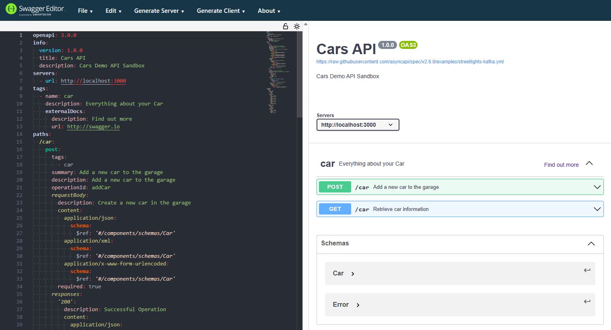

# Creating an OpenAPI Swagger Definition and an AutoRest SDK

1. Go to https://editor.swagger.io/
2. Make a call to every endpoint by filling in your URI, methods (POST, GET, PUT, etc) and any other parameters and authentication details for the API (See editor window screenshot below).
You will notice the Swagger doc UI simultaneously update based on what you input.

3. Once completed, export the definition file as a .yaml and .json file.
#Generating Client SDKs with Autorest
4. Install Autorest: 
  ```
  npm install autorest
  ```
5. Next, we want to tell AutoRest which swagger file to generate (`--input-file=`) as well as the language we want our SDK to be generated in (`--python`, `--go`, etc). Finally, we can tell AutoRest where we want the generated files to be outputted to (`--output-folder=`)
  ```
  autorest --input-file=example.json --python --output-folder=myFolder/
  ```
# Resources
## OpenAPI:

  [OpenAPI Repository](https://github.com/OAI/OpenAPI-Specification)
  
  [Video Walkthrough on creating a Swagger Doc](https://www.youtube.com/watch?v=mViFmjcDOoA&t=382s)

## AutoRest

  [AutoRest Repository](https://github.com/Azure/autorest)
  
  [Generating Clients with AutoRest](https://github.com/Azure/autorest/tree/main/docs/generate)
  
